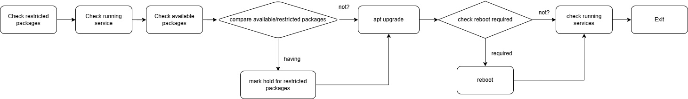
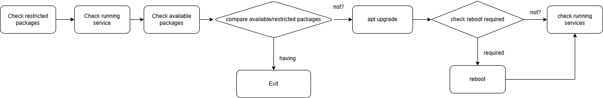

## Clone this git for start:

```bash
git clone git@github.com:hhai-le/ansible-playbook.git
cd ansible-playbook/
```

## Editing value of variables for connecting to vcenter from ansible controller:

##### vars_for_vmware.yaml

```yaml
---
# example
vcenter_hostname: 192.168.1.1
vcenter_username: administrator@vsphere.local
vcenter_password: password
datacenter_name: "DC"
template_name: "vm-template"
datastore_name: "datastore"
folder_name: "/DC/vm/vm-folder"
cluster_name: "Cluster"
networks_name: "portroup-name"
networks_ip: "192.168.1.2"
dns1: "192.168.1.3"
dns2: "192.168.1.4"
guest_domain: "localhost.localdomain"
```

#### Deleting a machine from inventory
```bash
ansible-playbook -i inventory_for_vmware.yaml -e "@vars_for_vmware.yaml" -e "vm_name=<name of VM machine>" vmware-delete/main.yaml
```
##### example: vm_name=ubuntu22VM-test


#### Deploy machine for template:

```bash
ansible-playbook -i inventory_for_vmware.yaml -e "@vars_for_vmware.yaml" -e "template_name=<name of template>" -e "vm_name=<name of machine>" -e "vm_hostname=<hostname of VM>" vmware-deploy/main.yaml
```
##### example: template_name=ubuntu22-template


##### example: vm_name=ubuntu22-testdeployed


##### example: vm_hostname=deployedbyansible


#### patching
```bash
ansible-playbook -i inventory_for_linux.yaml -l patching patching/main.yaml
```

##### patching flow for updating all packages without restricted packages:



##### patching flow for exiting when met restricted packages:
